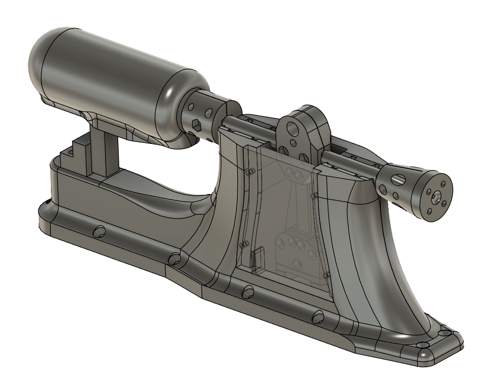
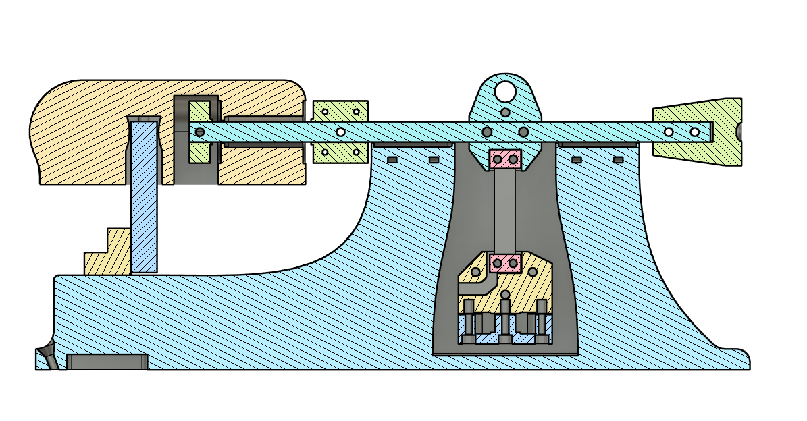

# Open Thrust Stand

This is a repo of parts, scripts, and information about the ArduPilot-based thrust stand.

The point of this project was to produce a low-cost thrust stand capable:
- Measuring thrust and torque.
- Being controlable from ArduPilot.
- Providing data that can be used for calculating the thrust linearisation coefficient needed for fixed-pitch lifting rotors on ArduPilot vehicles.

Video of original talk: [Youtube Link](https://www.youtube.com/watch?v=xQXkWjY6EkU&list=PLC8WVaJJhN4zE8bW97rS3cNFjsDg0rOaD&index=25)

## Disclaimer
- This project should not be considered as a step-by-step guide.
- It should be considered a difficult project, with numerous tools required to create the final object.
- With 3D prints being in the primary load path, the strength of your parts will vary based on your choosen materials, printer settings, and the printer itself.  Please take care when testing, I accept no liability for any injuries or damage caused.

## License
- **Parts:** CC-BY-SA Creative Commons Attribution Share Alike (https://creativecommons.org/licenses/by-sa/4.0/deed.en)
- **Scripts/Code:** GPLv3 (https://www.gnu.org/licenses/gpl-3.0.en.html)

## Known Design Flaws

Before you start building this thrust stand, you should be aware of some of the flaws with this current design.

1) There is significant rotor blockage from the thrust stand base.  This will effect the measurement of the generated thrust.  The measurements are therefore useful for relative comparisons between propulsion systems that have been measured on this stand.  The blockage does introduce some error in the measurement.  That being said, I found that it produceses reliable and repeatible measurements, you just need to be aware when comparing to other data sets or considering the installed thrust on your vehicle.

2) This design does use one aluminium part from a cheap thrust stand I purchased as part of the background reasearch for this project.  A new part needs to be designed to replace this.  The part in question is the [load cell mount](./Thrust%20Load%20Cell%20Assembly/Load%20Cell%20Mount%20-%20Alu.step)

## Hardware Parts Needed
- M3 & M2 heat set inserts
- Various M3 & M2 allen bolts
- 2x Load Cells
- Wood Screws
- Bearings (Ball Bearings, Thrust Bearings, & Linear Bearings or Graphite Bearings)

>[!NOTE]
>These parts do not include parts needed for the archived enclosure.   

## Electronic Parts Needed
- [SparkFun Qwiic Scale - NAU7802](https://thepihut.com/products/sparkfun-qwiic-scale-nau7802?variant=39726895562947&country=GB&currency=GBP&utm_medium=product_sync&utm_source=google&utm_content=sag_organic&utm_campaign=sag_organic&gad_source=1&gclid=Cj0KCQjwt8zABhDKARIsAHXuD7ZZc3koXD5XQqVzhc61Xw0OuyQfrP-f93Ldi11c2c5daBT7z0ExsJYaAuGWEALw_wcB)
- SPST Switch (Hardware Safety Switch)
- Addressable LED strip supported by ArduPilot (e.g. WS2812b)
- Flight controller that is supported by ArduPilot and has sufficient memory to run scripting. (e.g. CubeOrange or MATEK H743)

## Tools Needed:
- 3D Printers (Mostly FDM but Resin SLA was used for LED Lenses in Enclosure)
- Angle grinder or other form of grinder
- Drill
- Screw Drivers
- Allen Keys
- Soldering Iron

