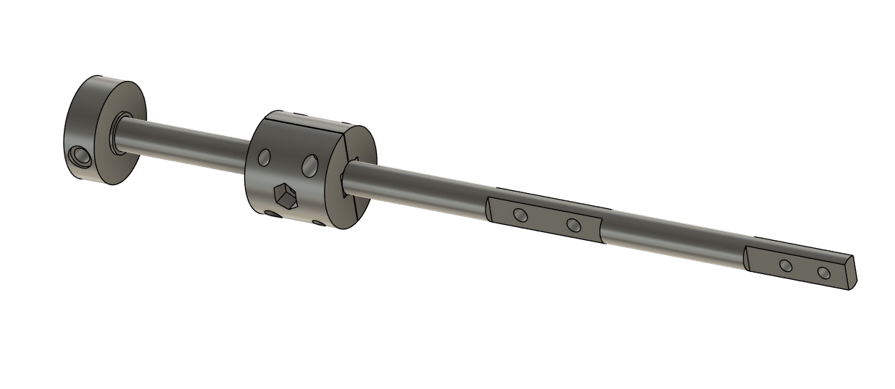
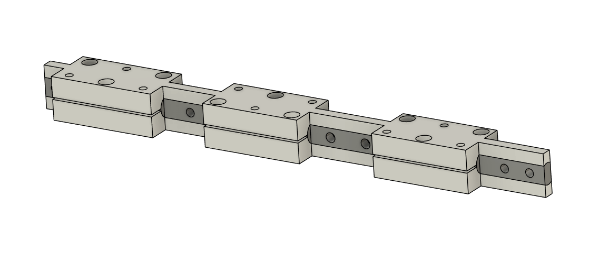
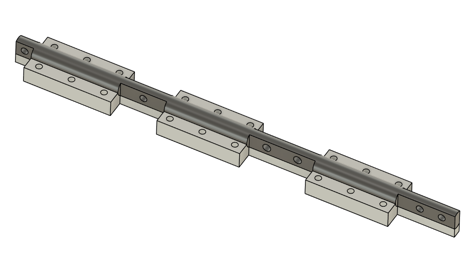

# Shaft & Bearing Mounts

In this directory you will find the bearing retainers and the guides for grinding the flats into the linear rail. 

# Grinding Guides

The 3D printed grinding guides are used to clamp around the shaft and provide a guide of where to grind away the flats on the linear rail.

You will need to grind away the flats gradually, to avoid building up too much heat in the rail and the 3D prints.  Excessive heating of the rail could warp it and cause more friction in the system.  Melting of the 3D prints will lead to an inaccurate guide.

Rest assured, Once you have grinded past the hardend surface on the linear rail, the steel is quite soft beneath it, so it is easy to drill the holes in.

The holes in the guide are sized so that an M3 will bite into the plastic.  Heat set inserts are not needed in this part.

