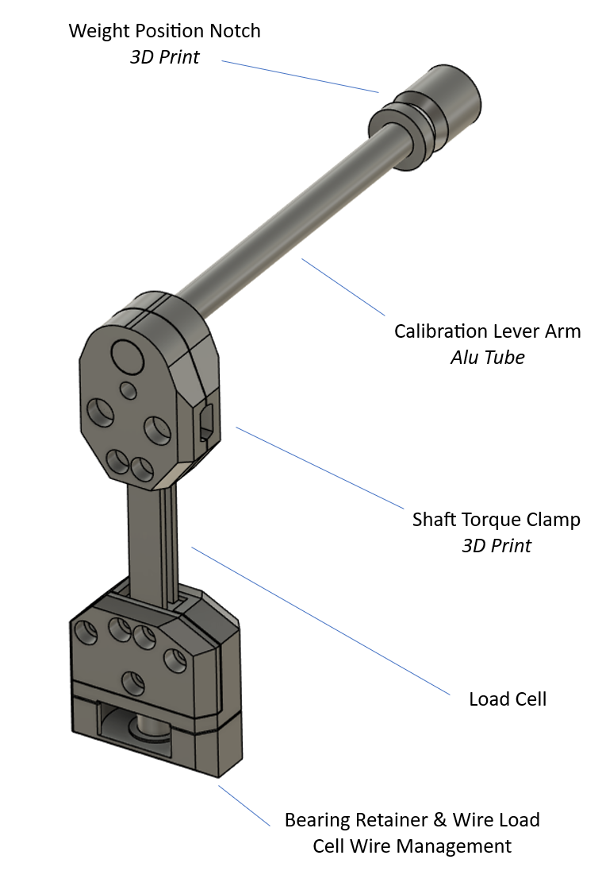
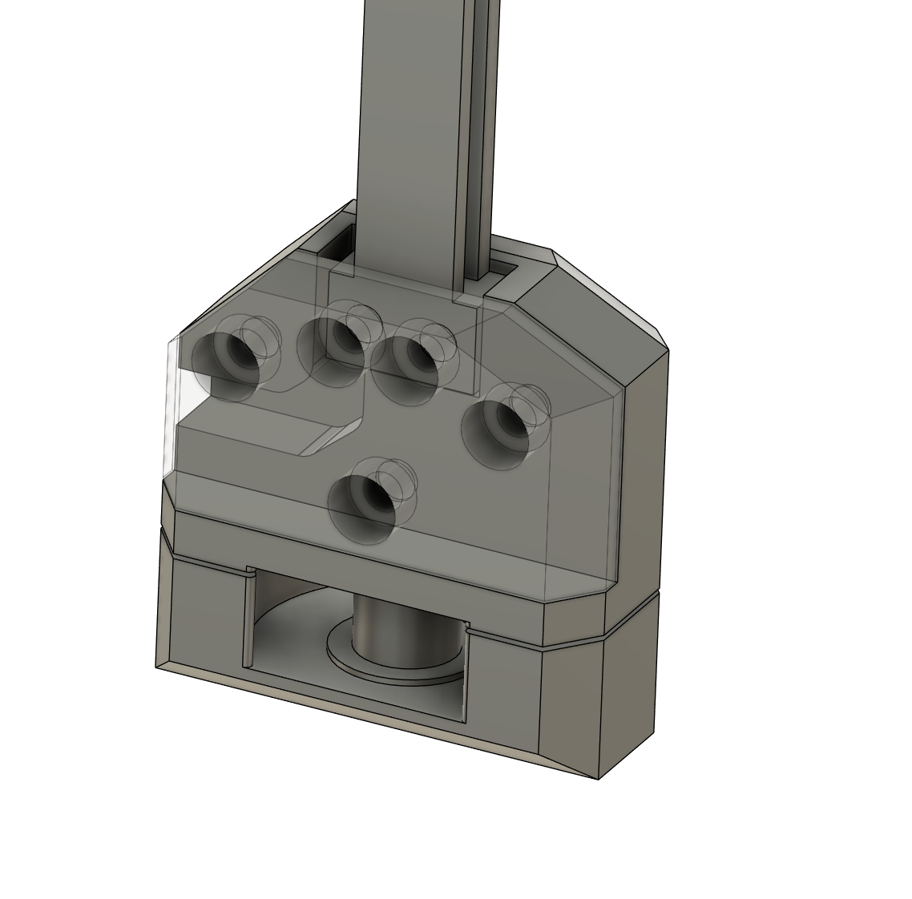

# Torque Load Cell Assembly

Assembly is used to clamp on to main shaft, translating all torque reaction through the load cell. Bearing in bottom is used to maintain a point load with minimal friction resistance in fore/aft translations. 

